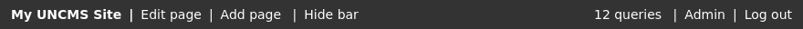

# The edit bar

UnCMS comes with a completely optional edit bar that you can display on the front-end of your site to admin (staff) users.
It is a big quality of life improvement for non-technical users using Django sites.
It is pre-styled with neutral styling which will not look out of place on most sites.
It looks like this:



(Note that "My UnCMS Site" above is an example only; nothing will be displayed if you do not configure a site name, as described below.)

It gives you the following:

* A link to edit the currently-displayed object in the Django admin (based on "object" in the template context, falling back to the current UnCMS page).
* A link to add new objects of the current type (falling back to UnCMS pages).
* A button to temporarily hide the edit bar, which is useful when taking screenshots).
* A link to the admin, saving your users from having to open a new tab to do quick edits.
* A button to log out.
* In local development, displays the number of database queries which have been executed. On typical sites, this does probably half of the work of diagnosing performance problems as fancier alternatives like [Django Debug Toolbar](https://django-debug-toolbar.readthedocs.io/en/latest/) and [django-silk](https://github.com/jazzband/django-silk).

## Adding it to your site

Add the stylesheet to the `<head>` of your document.
Note the `` guard to only show it for staff users; stylesheets are render-blocking and thus will slow down site loads for normal users.

```

  <link rel="stylesheet" href="">

```

Add this before your closing `</body>` tag (if you have `<script>` tags there, this should go before them):

```


```

Optionally add SITE_NAME to your [configuration](configuration.md); this will be displayed in the edit bar if it is present.

```
UNCMS = {
    # ... your other options here ...
    "SITE_NAME": "My UnCMS Site",
}
```

## Styling the edit bar

The edit bar is pre-styled to be unobtrusive.
It uses a dark-ish background and white text.
It inherits from your default body font and uses a font size of `0.875rem`.

The most common thing you will want to change is the background colour.
You can do that by overriding CSS variables:

```
:root {
    --edit-bar-bg: #fff;
    --edit-bar-fg: #000;
}
```

Or by targeting the `.edit-bar` class, which is how you can change all other properties:

```
.edit-bar {
    color: #000;
    background-color: #fff;
}
```

It has a `z-index` of 10.
If you are routinely using `z-index` values larger than this, your CSS needs reworking.
But if you are stuck with it, you may increase it.

```
.edit-bar {
    /* to repeat: if you use indices this large you are doing bad CSS! */
    z-index: 9999;
}
```

Further styling can be made by targeting the individual item classes.
These will not be described here (because you have a DOM inspector in your devtools).
All items in the edit bar use the [BEM](https://getbem.com/) naming methodology,
which means that everything can be targeted with a single class name.

For [Jinja2](using-jinja2.md) the function is called `render_edit_bar` and is availble in `uncms.jinja2_environment.all.environment`.
