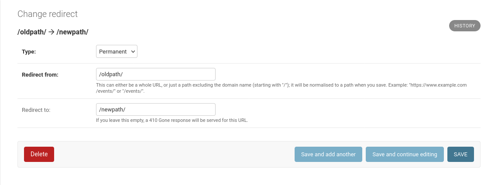
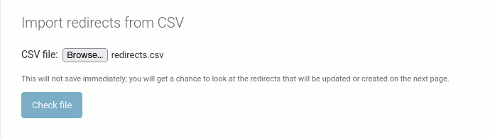
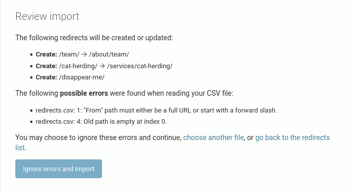
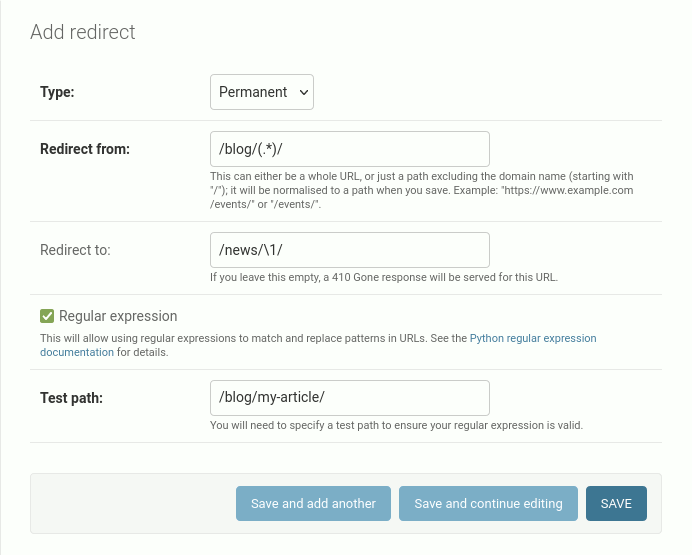

# The redirects app

Most sites will require some means of redirecting users from one location,
where a 404 would normally be served,
to a new location.
Django has one of these [built in](https://docs.djangoproject.com/en/dev/ref/contrib/redirects/),
but it is limited.
It does not allow you to change the redirect type per-redirect (only for all redirects).
It is dependent on Django's [sites framework](https://docs.djangoproject.com/en/dev/ref/contrib/sites/).
Its admin interface is a little clunky;
UnCMS's redirects app has a couple of little conveniences (such as URL normalisation) which make it much faster to use in practice.
And UnCMS's redirects app has regular expression support and CSV import.

## Configuration

Add `'uncms.redirects'` to your `INSTALLED_APPS`.

Add the redirects middleware to the _end_ of your middleware list, like so (in particular, this should appear after the [pages](pages-app) middleware):

```python
MIDDLEWARE = [
    #
    # ... all your other middleware goes here...
    #
    'uncms.redirects.middleware.RedirectFallbackMiddleware',
]
```

The redirects middleware will _only_ kick in if the response would have otherwise been a 404.
So if an existing URL route is already served by something else, the redirect will have no effect.

## Creating redirects in the admin

After following the above instructions, you will have a new "Redirects" app in your admin with a single model, "Redirect".
Clicking "Add redirect" will give you this form:



"Type" allows you to choose whether a redirect is permanent or temporary.
Usually, you want to pick "Permanent", which is the default.

"Redirect from" is the old path.
It can be of the form `/oldpath/`.
But, for convenience when copy-pasting from some other source (e.g. your browser),
it may also be a full URL such as `https://example.com/oldpath/`.
This will be normalised to a path when you save.

"Redirect to" may be a path of the form `/newpath/`.
It may also be a full URL such as `https://example.com/newpath/`.
As an added convenience, if the hostname part of "Redirect to" is in your [`ALLOWED_HOSTS` setting](https://docs.djangoproject.com/en/4.2/ref/settings/#allowed-hosts) and the protocol part is `http://` or `https://`, it will also be normalised to a path on save.

"Redirect to" may also be an empty string, in which case requests for this URL will return a 410 Gone response.
This is probably the best way of indicating to search engines that a page should be de-indexed.

## Bulk importing redirects

Experience has shown that while building out a new site it is often useful for developers, content authors and clients to collaboratively work on a spreadsheet of redirects (e.g. in Google Docs).
At the end of the build-out stage this spreadsheet can be exported to CSV,
and then imported into the new site.
Your author has written several ad-hoc, just-about-good-enough importers over the years,
so UnCMS comes with a good one by default.

You may bulk import redirects from a CSV file via either a management comand or via the admin.

Both of these methods expect a CSV file with at least two columns;
the old path, and the new path.
Both methods may have an optional header row in the CSV file, and have different means for skipping the header;
the management command has a command-line switch for this, and the admin import will treat it as an error which can be ignored.
Any other columns will be ignored.
Both methods are smart enough to update existing redirects, rather than ignore them, or panic.
Neither method will cause any existing redirects to be deleted.

In both cases, all redirects will be created as permanent ones.
In both cases, the importers are smart enough to update any existing entries

The management command is called `import_redirects_csv` (e.g. `./manage.py import_redirects_csv`).
It takes one or more CSV files as positional arguments.
All errors (e.g. malformed paths) will by default be terminal;
no redirects will be created if one of the entries is bad.
You may change this behaviour by providing the `--ignore-errors` option which will cause bad entries to be skipped.
If your CSV file contains a header row, supply the `--skip-header` option to skip the first row of the file.
Typical usage of this command will involve adding the CSV file to your repository, deploying your code, then running the management command on the live site.

You may also import a redirects CSV in the admin, via the "Import CSV" link shown in the redirects list
(which will be available to any admin user with both the "Add redirects" and "Change redirects" permission).
This gives you the following form...



...and after hitting "Check file", will give you a chance to review the redirects that will be imported:



In this case, our CSV file had a header row causing the first error, and an empty cell in the first column on line 4 causing the second one.
But, you are allowed to ignore these errors and continue; this will cause those lines to be skipped (a non-meaningful redirect will never be created).

You may disable CSV import in the admin with the [`REDIRECTS_CSV_IMPORT_ENABLED`](configuration.md?id=redirects_csv_import_enabled) configuration option.

For more advanced usage, you may want to consider the [django-import-export](https://django-import-export.readthedocs.io/en/latest/) package.

## Using regular expressions

Sometimes, you will have a large number of redirects that need to be created,
all of which will have a common prefix, and share some part of the rest of their paths.
For example, you may have a number of articles under `/blog/` which you want to move to `/news/`.
It might be tedious to create a large number of redirects of the form `/blog/my-article/` 🡢 `/news/my-article/`.
For this use cases, it is possible to create regular expression redirects.

This feature is disabled for a few reasons:

* It is very powerful, which means it is easy to get wrong (and getting it wrong can cause a large number of 404s)
* It isn't really needed for most sites
* It is slower in operation, because _every_ redirect must be loaded and checked for any given path. (This does not affect _normal_ operation of your site, as redirects only kick in for the case where a 404 would otherwise be served.)

But, if you need it, you _really_ need it. To enable the feature, add the `REGEX_REDIRECTS` option to your `UNCMS` configuration:

```python
UNCMS = {
    # ...your other settings here...
    'REGEX_REDIRECTS': True,
}
```

This will give you a "Regular expression" checkbox for any redirect you add:



In our screenshot above, we've redirected anything under `/blog/` to `/news/` using a group which is substituted in "Redirect to" (the `\1` part).
The "test path" field is required; this will allow you to test that it works (this will appear in the "Test" column in the redirects list),
and is also used during validation of the field.
A bad regular expression or a bad substitution will cause a validation error preventing you from saving the redirect.
