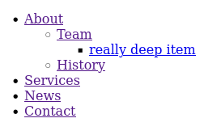

# Rendering and customising your page navigation tree

Once you have created some [pages](pages-app.md), rendering your navigation in your base template is simple.

```
<nav>
  {{ render_navigation(pages.homepage.navigation) }}
</nav>
```

That's it!
It is worth looking at this tag for a moment before we continue on to how to style and customise the main menu.
`render_navigation` will render a navigation template with a list of page nodes.
`pages.homepage.navigation` means "all pages that are children of the homepage that have the `in_navigation` field set to True".
So, this example usage of the tag will render a navigation tree for your entire site.

But you may also use it for rendering the navigation for any other page, as well.
For example, it is quite common to want to render a list of subpages for the current page.
So you can do something like this (we'll get onto what the `class_prefix` argument does later):

```
  <div class="sidebar">
    {{ render_navigation(pages.current.navigation, class_prefix="subpage-navigation") }}
  </aside>
```

Of course, the UnCMS [philosophy](philosophy.md) is to have no opinions on what the front end of your site should look like.
It is up to you to implement your own CSS for the navigation.
Your menu will look like this:



How to make it look like something is entirely up to you,
but UnCMS uses a rational class naming scheme that makes it easy to style with rational CSS,
and provides a lot of extension points in its templates in case it doesn't work quite the way you want it to.

## Styling with CSS

HTML elements in the navigation are given sensible class names according to the Block-Element-Modifier (BEM) [conventions](convention),
which allows targeting elements by a single HTML class name (mostly).

The CSS selectors you will want to use are these
(note that the prefix `navigation` in all of these items may be changed; see
"customising class names" below).

* `.navigation`: the top-level `<ul>` tag containing top-level navigation items
* `.navigation__item`: a top-level item in the navigation
* * `.navigation__item--current`: a top-level item which is the currently active page
* * `.navigation__item--here`: a top level item which is the currently-active page, _or_ one of its children is the currently-active page
* * `.navigation__item--has-children`: a top-level item which has child items
* `.navigation__item-link`: the link `<a>` for a top-level item in the navigation
* *  `.navigation__item-link[aria-current='page']`: the link for an item which is the currently-active page
* `.navigation-submenu`: a submenu (e.g. a dropdown) inside a top-level navigation item _or_ inside another submenu navigation item
* `.navigation-submenu__item`: an item within a navigation submenu
* * `.navigation-submenu__item--has-children`: a navigation submenu item which has children
* * `.navigation-submenu__item--current`: a navigation submenu item which is the currently-active page
* * `.navigation-submenu__item--current`: a navigation submenu item which is the currently-active page, _or_ one of its children is the currently-active page
* `.navigation-submenu__item-link`: the link (`<a>`) for a submenu item
* * `.navigation-submenu__item--link[aria-current='page']`: the link (`<a>`) for a submenu item which is the currently-active page

While UnCMS has no opinions about the front end of your site looks like,
__sample__ CSS is included in the static file `pages/css/sample-navigation.css`.
Note that,
its usage of Microsoft's widely-respected Comic Sans typeface notwithstanding,
this is deliberately ugly to discourage you from using it in real projects,
including usage of garish dropdown colours.
Its styling rules are intended to give you a base for implementing your own.

## Customising class names

You can customise the class name in two ways:

* by setting the `NAVIGATION_CLASS_PREFIX` [configuration option] (which defaults to `navigation`), or
* by supplying the `class_prefix` option to `render_navigation`

This will only change the prefixes.
Should you decide that you find the class naming style entirely intolerable,
you may proceed to override templates.

## Template overrides

For more advanced customisation, you might want to override the templates used to render the navigation.
TO give maximum flexibility, you may specify which template to use either in global settings (under the `UNCMS` dictionary)
or, for all except the top-level navigation template, as a keyword argument parameter to `render_navigation`.

### `pages/navigation/navigation.html`

* `render_navigation` parameter: none (cannot be overridden this way)
* Setting key: `NAVIGATION_TEMPLATE`

This renders all navigation items inside a `<ul>` tag.
It has the following extension points as blocks in the template:

* `attributes`: attributes to add to the opening `<ul>` tag
* `inside_top`: rendered immediately after the opening `<ul>` tag; use for (e.g.) custom navigation items that you wish to place before other items
* `inside_bottom`: rendered immediately before the closing `<ul>` tag; for custom navigation items that you wish to place after other items

### `pages/navigation/navigation_item.html`

* `render_navigation` parameter: `item_template`
* Setting key: `NAVIGATION_ITEM_TEMPLATE`

This renders a single top-level navigation item inside an `<li>` tag.
It has the following extension points as blocks in the template:

* `item_attributes`: attributes to add to the opening `<li>` tag
* `item_inside_top`: rendered immediately after the opening `<li> tag`
* `item_inside_bottom`: rendered immediately before the closing `<li>` tag
* `before_children`: rendered after the `<a>` tag has closed, but before rendering any child items
* `children`: renders the item's children
* `link_attributes`: attributes to add to the `<a>` tag
* `link_inside_top`: rendered immediately after the opening `<a>` tag
* `link_inside_bottom`: rendered immediately before the closing `<a>` tag

### `pages/navigation/navigation_submenu.html`

* `render_navigation` parameter: `submenu_template`
* Setting key: `NAVIGATION_SUBMENU_TEMPLATE`

This renders a navigation submenu (which may be nested arbitarily deep) within a `<ul>` tag.
It has the following extension points as blocks in the template:

* `attributes`: attributes to add to the opening `<ul>` tag
* `inside_top`: rendered immediately after the opening `<ul>` tag; use for (e.g.) custom navigation items that you wish to place before other items
* `inside_bottom`: rendered immediately before the closing `<ul>` tag; for custom navigation items that you wish to place after other items

### `pages/navigation/navigation_submenu_item.html`

* `render_navigation` parameter: `submenu_item_template`
* Setting key: `NAVIGATION_SUBMENU_ITEM_TEMPLATE`

This renders a navigation item for a single navigation submenu item within an `<li>` element.
It has the following extension points as blocks in the template:

* `item_attributes`: attributes to add to the opening `<li>` element
* `item_inside_top`: rendered immediately after the opening `<li> element`
* `item_inside_bottom`: rendered immediately before the closing `<li>` element
* `before_children`: rendered after the `<a>` element has closed, but before rendering any child items
* `children`: renders the item's children
* `link_attributes`: attributes to add to the `<a>` element
* `link_inside_top`: rendered immediately after the opening `<a>` element
* `link_inside_bottom`: rendered immediately before the closing `<a>` element

### A concrete example of template overrides

Let's give an example of how we would use a template override in a real project.
By default, the navigation templates included with UnCMS provide no indicator that a navigation item has a submenu.
It adds classes to the elements which you can target with CSS to add them yourself.
But, we might want to add an arrow to the element itself
(for example, by inlining an SVG, though we will use a Unicode arrow in our example).

First, let's create the template `pages/navigation/navigation_item_extended.html` with the following contents:

```



  {# be kind, rewind! always use super when extending #}
  {{ super() }}
  ⬇

```

Now, we can either specify this template in our `render_navigation` call...

```
{{ render_navigation(pages.homepage.navigation, item_template="pages/navigation/navigation_item_extended.html") }}
```

...or we can add this to our UnCMS configuration dictionary in our Django settings:

```
UNCMS = {
    'NAVIGATION_ITEM_TEMPLATE': 'pages/navigation/navigation_item_extended.html',
}
```
